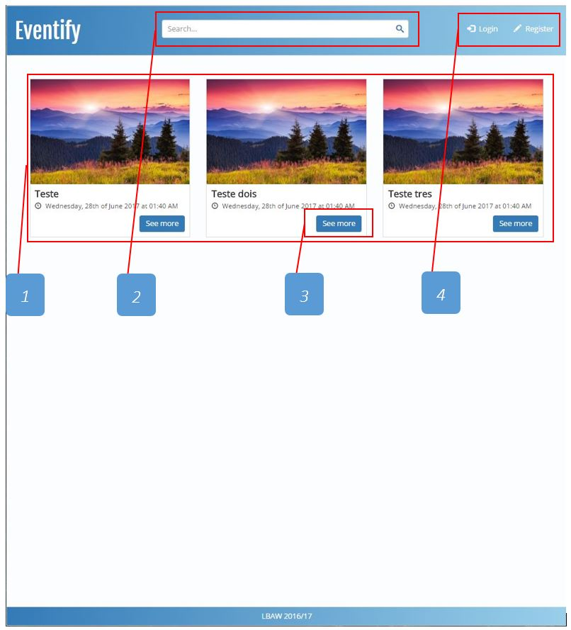
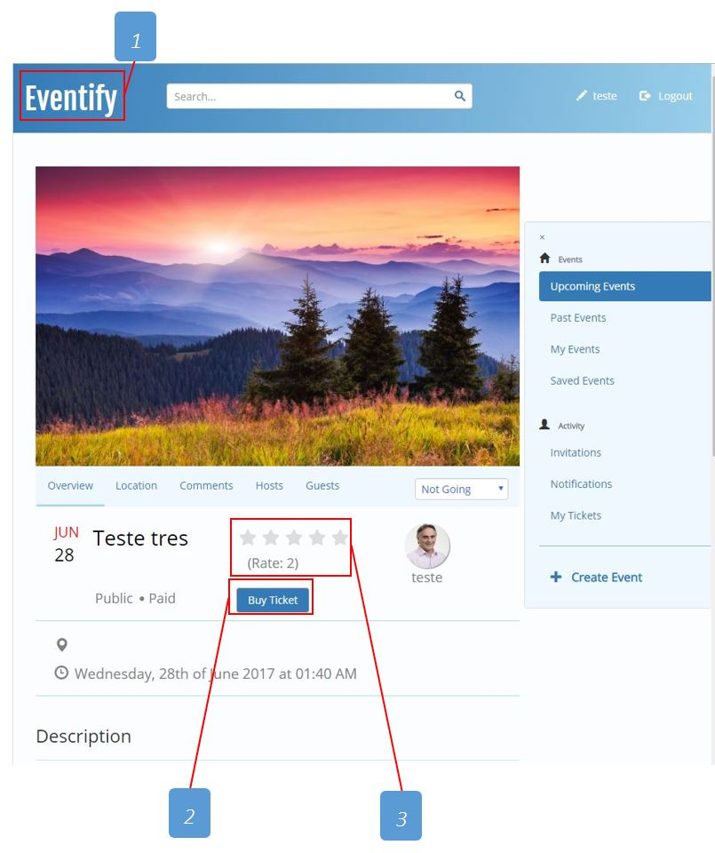
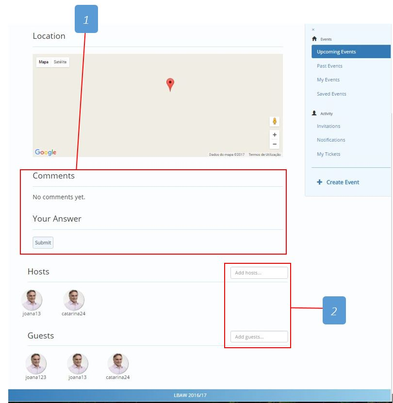
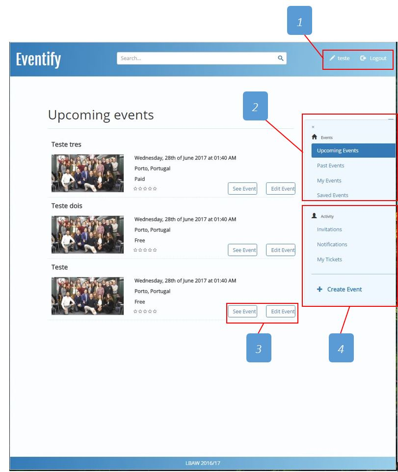
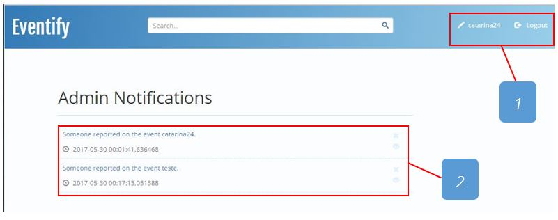
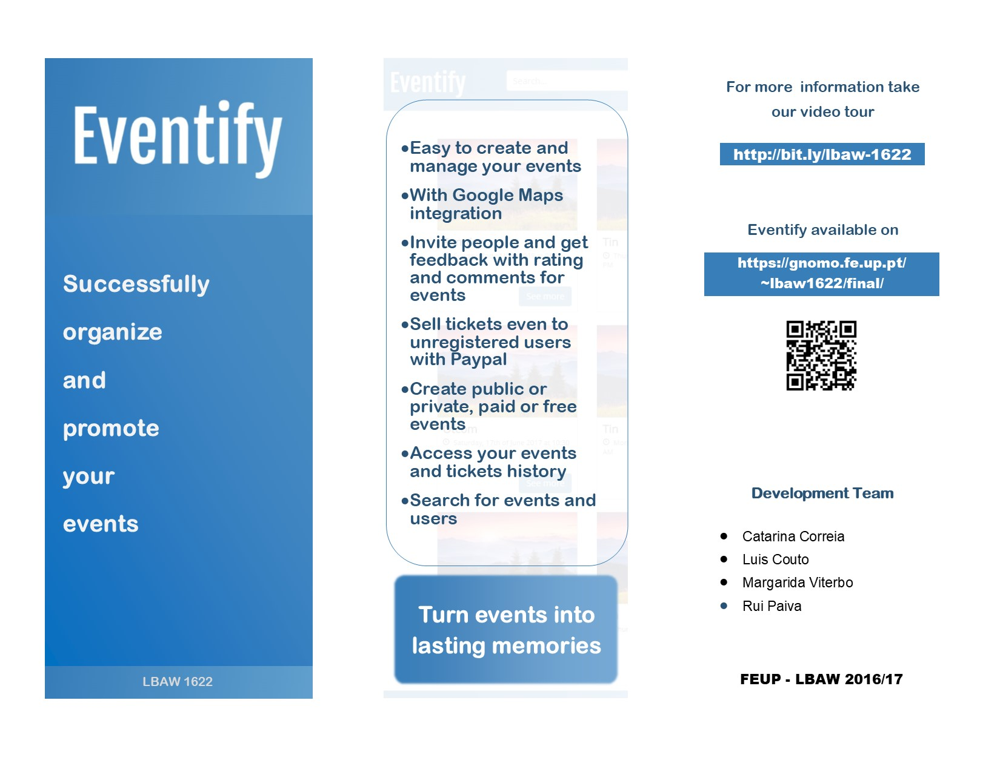

# Eventify

Eventify is an information system with a web interface to collaboratively manage events. It's a website to buy/sell tickets, organize and promote events.

### 1. Instalation

To experience our project, it´s required to download and extract the files to a web, or local, server with PHP and PostgreSQL database support.

 ### 2. Utilization

- Homepage

1: Public Events list 

2: Search (users ou events) 

3: Check event details 

4: Login and register new user 

- Event

1: Return to homepage 

2: Buy ticket for event 

3: Rate event 

1: Insert comment for event 

2: Add hosts and/or guests for event 

- Personal page

1: Go to personal profile or logout 

2: Personal events interaction 

3: See or edit events 

4: Personal activity interaction 

- Administrator

1: Go to personal profile or logout 

2: Manage notifications 

### 3. Promotional video

http://bit.ly/lbaw-1622

### 4. Promotional Brochure

